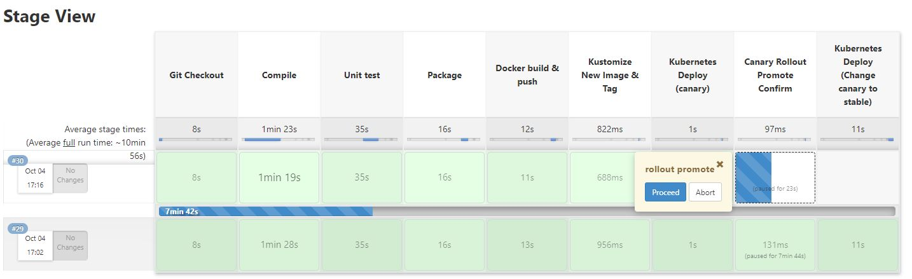
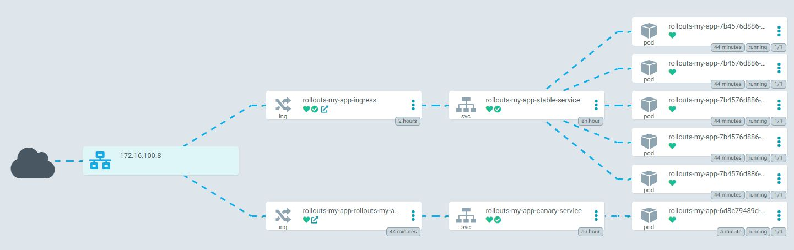
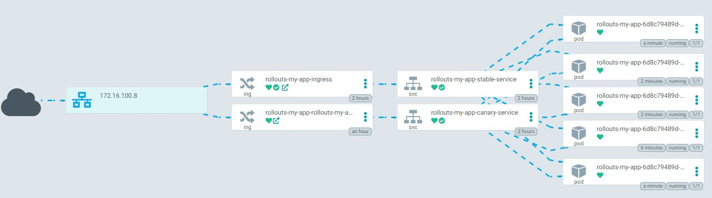

# CICD Pipeline 테스트

K8S 환경에서 jenkins 를 이용한 cicd 구성 샘플입니다.

## 구성

- Jenkinsfile : jenkins pipeline 소스
- k8s : kubernetes 에 sample app 배포를 위한 resources (kustomize 사용)
- 그 외 java source
  - [참고소스](https://github.com/leszko/calculator)

## 환경

1. Kubernetes 환경
2. [Jenkins 설치 on k8s](https://www.jenkins.io/doc/book/installing/kubernetes/)
3. [Argo rollout 설치 on k8s](https://argoproj.github.io/argo-rollouts/)
4. [Ingress Nginx Controller 설치 on k8s](https://github.com/kubernetes/ingress-nginx)

## Pipeline 순서

- canary 배포 후, promote 수행여부 체크

### canary 배포 시, 서비스 형태

### 배포 완료 시, 서비스 형태

## Reference

[Argo_Rollout_Canary_Example](https://github.com/hony7410/argo-rollout-canary-sample)
